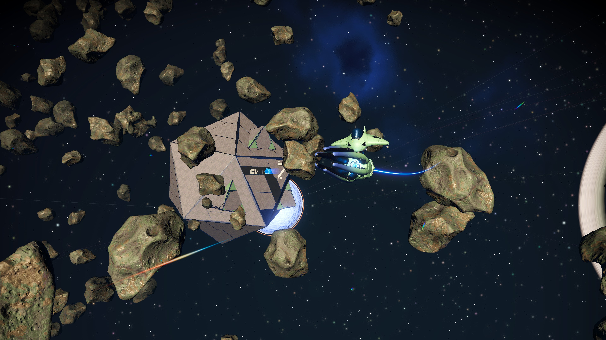

## Recreating a spaceship from no man's sky.

This was a project that I did for a course on computer graphics.
The final exercise was to create an original blender model and render it.
In the course, we built a 3d renderer in C++, so a bonus was rendering our model with the renderer we built.

While most people created variations on the donut tutorial, I decided to recreate a spaceship from a game i was playing at the time, No Man's Sky. I just fund a rare and beautiful starship that I wanted to show off by making a replica of it.

**Here are the reference screenshots I took in-game:**

It took me a while to figure out the sculpting of the spaceship, since it has a pretty unique and complex shape, unlike most spaceships in the game which are blocky and full of angles and straight lines (which makes sense since space has no air drag).

**This is my first draft render after a couple days of work:**

I decided to add asteroids, light streaks and a space station like in the reference photos, to create **the final product:**

I'm very happy and proud of my creation, i think it does at least a little justice to the beauty and wonder of the game and the spaceships and planets in it. My only regret is that I had no time to put a planet in the scene as well, as that would be a nice addition.

## Sources:

Took inspiration from this spaceship tutorial:
[https://youtu.be/erhh-q1BTm8](https://youtu.be/erhh-q1BTm8)

Used this tutorial to create rocks (asteroids):
[https://youtu.be/4EqLyGsu3AA](https://youtu.be/4EqLyGsu3AA)
(used this texture for them: [https://ambientcg.com/view?id=Rock035](https://ambientcg.com/view?id=Rock035)

Used this texture thingy (node) for the triangles on stuff:
[https://neveselov.gumroad.com/#aIGJC](https://neveselov.gumroad.com/#aIGJC)

Used this picture for the space background (by digitalmoons):
[https://digitalmoons.itch.io/free-space-background](https://digitalmoons.itch.io/free-space-background)

There were other tutorials that I followed and adapted for small parts of this project,
but I didn't copy their content and only used the techniques shown in them,
and there are probably too many to reference them all here.

Reference Image (reference.jpg) taken from the game No Man's Sky. I took the screenshot while playing it.
No other external help (that I can think of) was used in this project.
