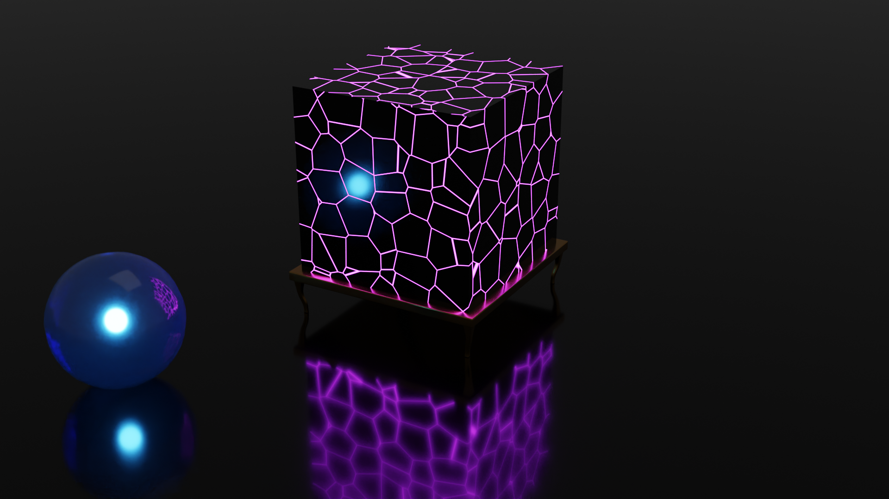

import Cursedgpu from './cursedgpu.mp4'
import Coolcube from './coolcube.mp4'
import Ballramp from './ballramp.mp4'

## A lot of small creations:

<video controls>
    <source src={Ballramp} type="video/mp4" />
    
A ball rolling down a ramp with motion blur

</video>
<video controls>
    <source src={Coolcube} type="video/mp4" />
    
A stack of cubes that comes crashing down

</video>

<video controls>
    <source src={Cursedgpu} type="video/mp4" />
    
A GPU made of wood catching fire.

</video>

 

