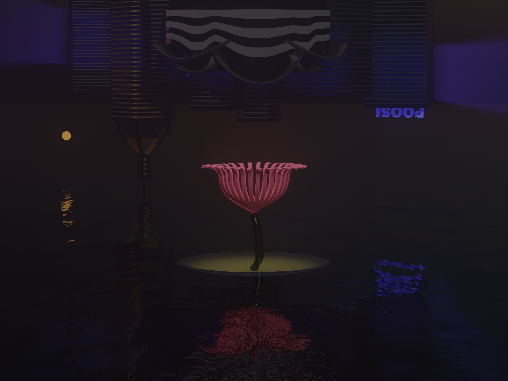

## Inspired by exchange in Hong Kong:

During the second half of 2022, I went to HK on exchange to study marine biology and climate change.
I decided to reflect on my experiences by creating an artwork dedicated to a friend I met in HK.
It depicts a flower emerging from the water on the background of some famous skyscrapers in HK, which are hanging upside-down.
I really enjoyed making the art and it means a lot to me.

