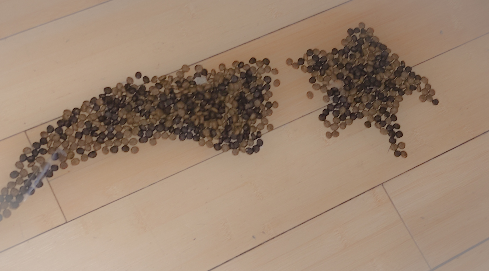
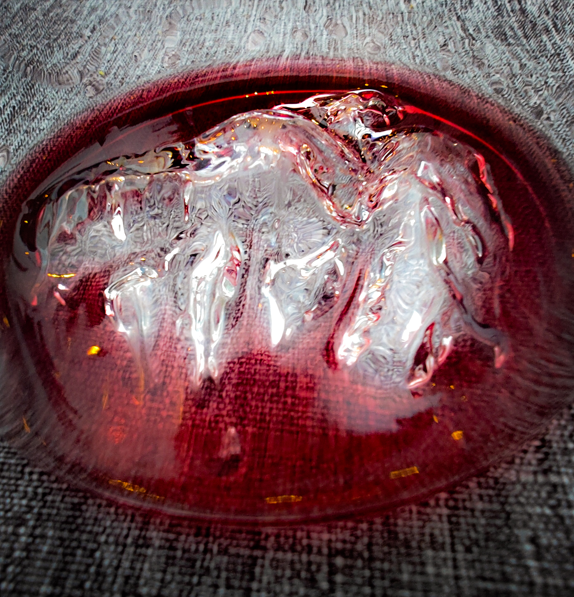
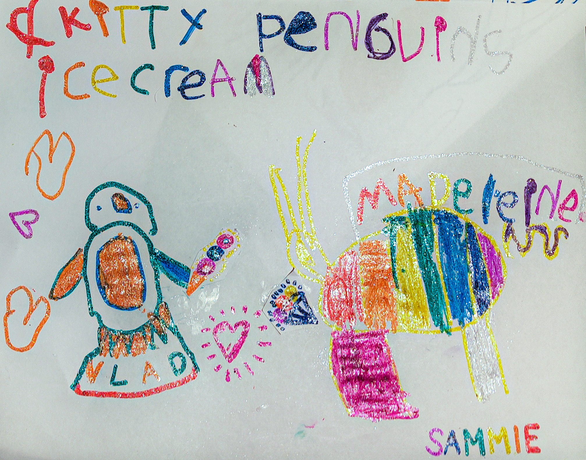
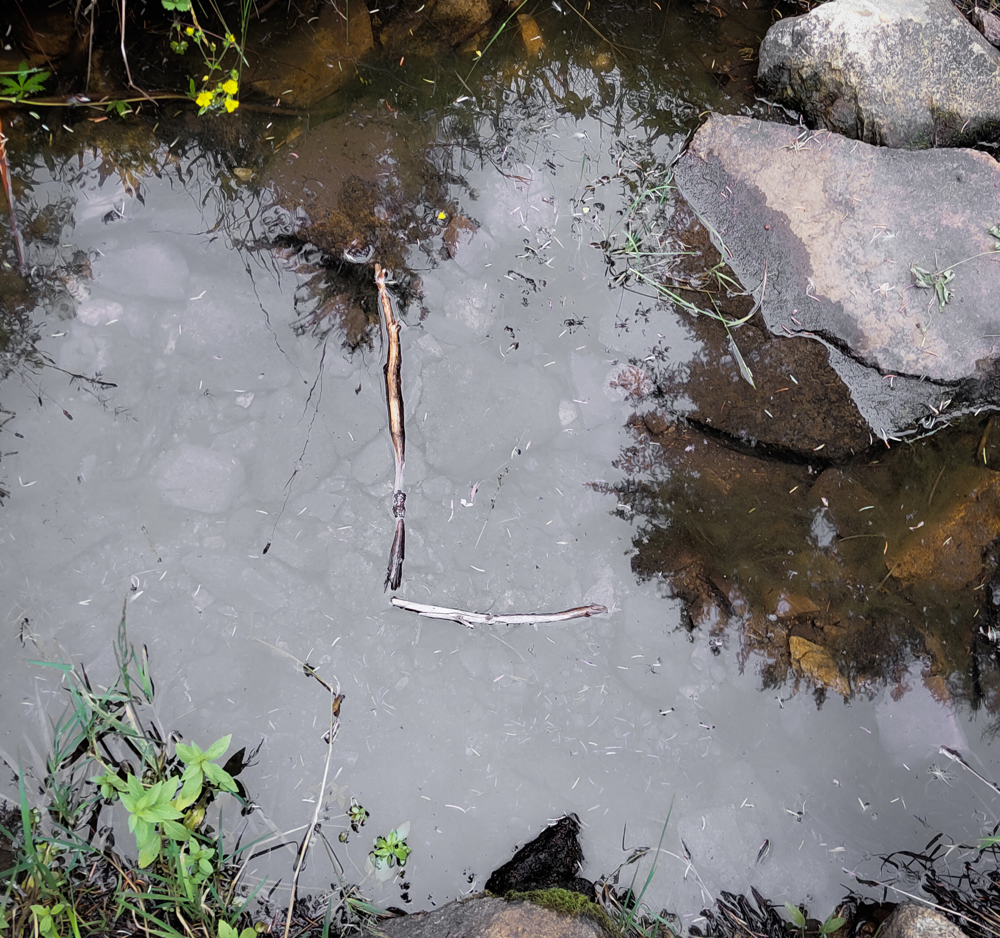

## Inspired by contrasting longevity and impermanence

Most of the 'art' in this collection is unconventional and really impermanent in reality. Capturing it on camera and uploading it to the internet, however, preserves it far beyond any time that it ought to exist for. For each of the artpieces, an estimated real-word longevity is given to emphasise that contrast.  

 

## Daily Challenge Format

The process of creating these works was spontaneous and took place over 1 week in August where every day I would challenge myself to create something I considered art and save it using my phone's camera.  

 

### Ecoterrorism, 2023
Cat food on floor  
_Longevity: 2 hours_

 

### Red Mountain, 2023
Red wine in glass  
_Longevity: 4 minutes_

 

### Kitty Penguin's Ice Cream, 2023
Glitter Marker on Paper  
_Longevity: Unknown_

 

### Gross Reservoir, 2023
Plants in glasses of water, brick and rocks on cutting mat  
_Longevity: 3 days_

 

### Brick Garden, 2023
Lego on cutting mat  
_Longevity: 1 day_

 

### Son of an accident, 2023
Climbin chalk on t-shirt  
_Longevity: 3 hours_

 

### Waterfal, 2023
Sticks on water puddle  
_Longevity: Unknown_

 
