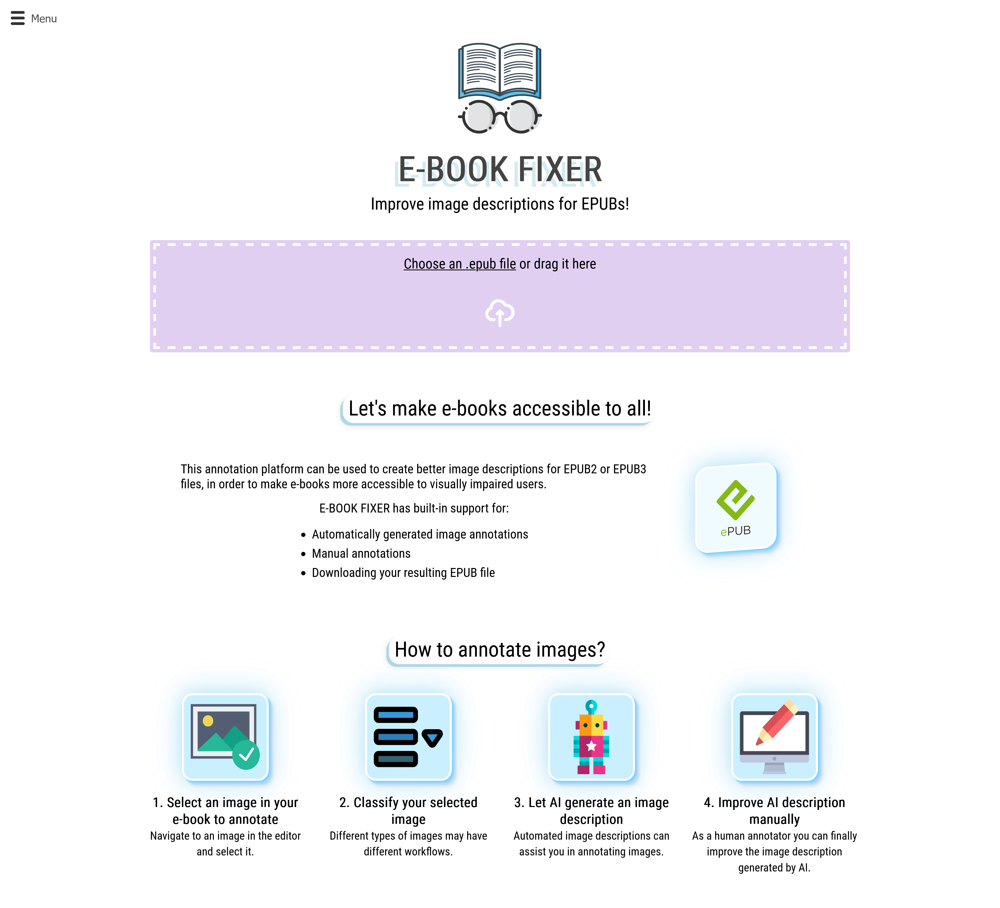

## Improving image descriptions for EPUBs!

This was done as part of a university course where 5 students are tasked to collaborate with a client coming from an external company to create a product. The client for my group was the dutch national library (KB)!

We currently stopped hosting the project.

The project is open-source, and you can view and use the code for it here:
[https://github.com/KBNLresearch/Ebook-Fixer](https://github.com/KBNLresearch/Ebook-Fixer)

Here is a screenshot of the front page:

