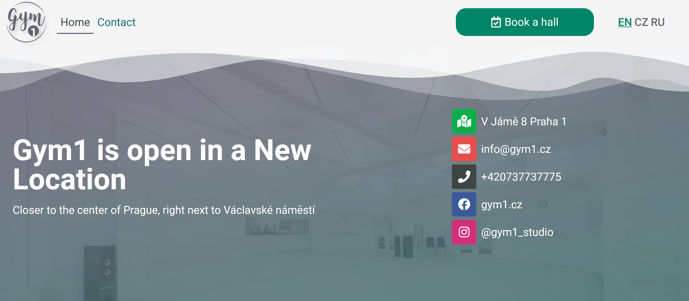

## A website for a small gym business.

I was asked by a family member to remake the website for a gym that they run.
The old website before was based on a strict and hard template so it was hard to edit.

I remade the website in wordpress using an intuitive and visual website builder. I decided to try using that even though It may have been easier to just code it, so that other people can access it and change it as well.

The project was a success and the website is now more intuitive and easy to navigate and edit.

Here's a screenshot of the homepage:

Mobile design was also a priority, so the website was designed for mobile users first, displaying important information about location and social media first.

The website also had to support 3 languages: English, Czech and Russian. Luckily there were Wordpress plugins that helped make that possible.
